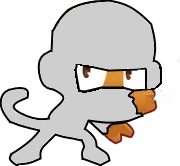

<h1 align="center">Space Monkey Mod</h1>

This mod has a 15 upgrades and a paragon, all different icons, and models for the tier 5's and the paragon.
There are still no unique models for tiers 0-4 or an portraits for anything besides the base tower and paragon.

